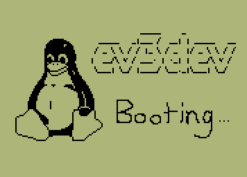

* Table of Contents
{:toc}

{:class="button"}

## What is ev3dev?

__LEGO MINDSTORMS EV3 is awesome... ev3dev is SUPER awesome!__

ev3dev is many things...

### ev3dev is EV3 software re-imagined
{:.no_toc}

If you are like us, you have probably found that while the software that
comes with the EV3 is great, it just doesn't do quite everything you would
like it to.

We have rebuilt much of the software for the EV3 from the ground up. We have
created our own hardware drivers using sysfs so that you can easily program
the EV3 using any [programming language]. It is as easy as reading from and
writing to a file.

This also means that ev3dev is NOT compatible with most other EV3 software
and tools.
    
### ev3dev is NOT firmware
{:.no_toc}

Think of it as dual boot. ev3dev is installed and runs on a microSD card and
does not touch the existing firmware in your EV3. To run ev3dev, just insert
a microSD card with ev3dev installed and boot your EV3. To boot from the
firmware, just power off and remove the microSD card.

### ev3dev is a Linux kernel
{:.no_toc}

We have taken the Linux kernel from LEGO, updated it to v3.16 and enabled
many hardware drivers. This means support for lots of Wi-Fi dongles,
Bluetooth gamepads and keyboards, USB audio device and more. If your
hardware works on Linux, it will probably work with ev3dev.

### ev3dev is Debian Linux
{:.no_toc}

The ARM9 processor in the EV3 is one of the [Debian] supported architectures.
This means most of the 37500+ Debian software packages will run on your EV3
- no compiling necessary. Installing a package is as simple as
`sudo apt-get install package-name`.
    
### ev3dev is more than just EV3
{:.no_toc}

The [ev3dev drivers][DKMS] will run on any Linux. This means you can use
LEGO MINDSTORMS and LEGO WEDO sensors and motors with anything that runs
Linux, from your desktop to you Raspberry Pi.
    
### ev3dev is a work in progress
{:.no_toc}

This is by no mean a polished product yet. But don't let that scare you away -
it is very usable. [You can help] make it better.

## What can it do?

ev3dev can...

* [Solve a Rubik's Cube](https://www.youtube.com/watch?v=HuKsfp19yF0)
* [Catch a ball](https://www.youtube.com/watch?v=Y0w_cRt7RzI)
* [Speak with an accent](https://www.youtube.com/watch?v=5otRPiJ6PYw)
* [Draw a dinosaur](https://www.youtube.com/watch?v=9pjpQoZoW6E)
* [Use WeDo sensors and motors](https://www.youtube.com/watch?v=NQ1PrJ2-yx8)
* Do just about anything you can imagine...

## How do you use it?

First, you need to download and install the latest image file on a microSD card.
Check out the [Getting Started] page for step-by-step instructions. Or, if you
are not using ev3dev with an EV3, check out the [DKMS driver package][DKMS].

Then, you can write a program however you like. You can use just about anything
with a SSH client - Windows, Linux, Mac, Android, iOS, Blackberry, etc. The
[docs] page has information about how to use the drivers and has links to
libraries contributed by users for some programming languages.

If you need some ideas, check out the projects on our [Share] page. If you get
stuck, check out the [Get Help] page.

[Debian]: https://www.debian.org/
[programming language]: /docs/libraries
[DKMS]: https://github.com/ev3dev/lego-linux-drivers-dkms
[You can help]: /contribute
[Getting Started]: /docs/getting-started
[docs]: /docs
[Share]: /share
[Get Help]: /support